# 🌊 RE:CRAFT (Upcycle Luxury & Circular Marketplace)
> **เอกสารสรุปภาพรวมโครงการ (Project Overview), กลุ่มเป้าหมาย (Target Audience) และฟังก์ชันระบบทั้งหมด (Feature Specifications)**

---

## 📌 1. ตัวงานคืออะไร? (What is RE:CRAFT?)

**RE:CRAFT** คือ **แพลตฟอร์มมาร์เก็ตเพลสเศรษฐกิจหมุนเวียน (Circular Economy Platform)** ที่เชื่อมโยงวงจรตั้งแต่ **"คนเก็บขยะชายหาด"** สู่ **"ผู้ผลิตชิ้นงาน"** และ **"ผู้ซื้อสินค้าพรีเมียม"** ครบวงจรในที่เดียว 

โมเดลธุรกิจของ RE:CRAFT ไม่ใช่เพียงการขายของรีไซเคิลทั่วไป แต่เป็นการทำ **Upcycling สู่ระดับ Eco-Luxury & Collectibles** โดยเปลี่ยนขยะไร้ค่า เช่น เศษแก้วขัดคลื่นทะเลหาดบางแสน, ฝาขวดน้ำพลาสติก HDPE, จานเบรกเก่า, หรือซากแหอวนประมง ให้กลายเป็นเครื่องประดับลักชัวรี, ของสะสม, แว่นตาแฟชั่น และของแต่งบ้าน ที่มี**ชิ้นเดียวในโลก (One-of-a-kind)** 

### วงจรการทำงานของระบบ (Circular Ecosystem):

```mermaid
flowchart LR
    A["1. คนเก็บขยะชายหาด<br>(บางแสน/พัทยา)"] -->|"ส่งขยะขายรับเงิน"| B["2. RE:CRAFT Hub<br>(รับซื้อ ทำความสะอาด ฆ่าเชื้อ)"]
    B -->|"จัดชุดคิทวัตถุดิบ"| C["3. คลังวัตถุดิบขยะ<br>(Supply Hub)"]
    C -->|"นำวัตถุดิบไปทำตามสูตร"| D["4. คนทำสินค้า/ช่างฝีมือ<br>(ใช้ Blueprint Studio)"]
    D -->|"โพสต์ลงขาย/ประมูล"| E["5. ตลาดกลาง RE:CRAFT<br>(ตรวจสอบโดยแอดมิน)"]
    E -->|"ซื้อ/เคาะประมูล"| F["6. ลูกค้า/นักสะสม<br>(ชมมุมมอง 360° + สตอรี่)"]
```

---

## 👥 2. กลุ่มเป้าหมายและลูกค้าคือใคร? (Target Customer Segments)

แพลตฟอร์มถูกออกแบบขึ้นมาเพื่อตอบสนองผู้ใช้งาน 4 กลุ่มหลัก:

### 1) กลุ่มผู้ซื้อสินค้าและนักสะสม (Buyers & Art Collectors)
* **ใครคือกลุ่มนี้:** กลุ่มคนรุ่นใหม่ (Gen Z & Millennials), ผู้รักงานดีไซน์มินิมอล, คนที่สนใจเรื่องสิ่งแวดล้อมและความยั่งยืน (Eco-Conscious Shoppers), นักสะสมเครื่องประดับและงานอาร์ตทอย
* **สิ่งที่เขาต้องการ:**
  * สินค้าที่มี **Storytelling** ชัดเจน (รู้ว่าขยะชิ้นนี้มาจากไหน เคยเป็นอะไร ผ่านอะไรมา)
  * สินค้าดีไซน์พรีเมียม ไม่เหมือนขยะรีไซเคิลราคาถูก
  * ประสบการณ์ตรวจสอบสินค้าอย่างละเอียดเสมือนอยู่ในแกลเลอรี (มุมมอง 360 องศา, ภาพ Macro Texture Detail)
  * ความตื่นเต้นจากการประมูลสด (Live Auction) แย่งชิงของที่มีชิ้นเดียวในโลก

### 2) กลุ่มผู้ผลิตและคนหารายได้เสริมที่ "ไม่มีหัวศิลป์" (Makers & Non-Artists)
* **ใครคือกลุ่มนี้:** บุคคลทั่วไป, ผู้ว่างงาน, นักศึกษา หรือชาวบ้านที่ต้องการสร้างรายได้เสริม แต่กังวลว่าตัวเอง "ไม่มีทักษะทางศิลปะ"
* **สิ่งที่เขาต้องการ:**
  * มี **"พิมพ์เขียวอัพไซเคิล (Blueprints)"** เป็นสูตรสำเร็จรูปบอกวิธีทำทีละขั้นตอน (Step-by-Step)
  * มีแหล่งสั่งซื้อวัตถุดิบขยะที่คัดแยก ล้างทำความสะอาด และฆ่าเชื้อมาแล้วแบบพร้อมประกอบ
  * มีผู้ช่วย AI ช่วยเขียนแคปชั่น/สตอรี่ขายของ และช่วยตั้งราคาประมูลที่ทำกำไรได้จริง

### 3) กลุ่มผู้เก็บและคัดแยกขยะ (Waste Harvesters & Local Community)
* **ใครคือกลุ่มนี้:** ชาวบ้านริมชายหาดบางแสน/ชายฝั่งไทย, นักท่องเที่ยวสายจิตอาสา (Beach Cleaners), กลุ่ม Plogging (วิ่งเก็บขยะ)
* **สิ่งที่เขาต้องการ:**
  * ช่องทางเปลี่ยนขยะที่เก็บได้ให้กลายเป็น **"เงินสดทันที (Cash on Drop-off)"** หรือ **"เครดิตซื้อสินค้า (+15% Bonus)"**
  * ระบบที่บอกราคาขยะแต่ละประเภทชัดเจน โปร่งใส ไม่โดนกดราคาเหมือนร้านรับซื้อของเก่าทั่วไป
  * ความภาคภูมิใจที่เห็นขยะที่ตนเก็บถูกนำไปเปลี่ยนเป็นงานศิลปะระดับมาสเตอร์พีซ

### 4) กลุ่มแอดมินและผู้ตรวจสอบมาตรฐาน (Admins & Curators)
* **ใครคือกลุ่มนี้:** ทีมงาน RE:CRAFT ทำหน้าที่ดูแลระบบนิเวศ ควบคุมคุณภาพ (Quality Assurance) และป้องกันการฟอกเขียว (Anti-Greenwashing)
* **สิ่งที่เขาต้องการ:**
  * ระบบตรวจสอบที่มาของขยะ (Provenance Check) ก่อนอนุมัติสินค้าขึ้นหน้าเว็บ
  * ระบบจัดการคิวรับซื้อขยะจากประชาชน และเติมสต็อกวัตถุดิบเข้าคลังอัตโนมัติ

---

## 🛠️ 3. ฟีเจอร์และบริการที่มีให้ใช้งาน (Comprehensive Features)

### 🛍️ หมวดที่ 1: ระบบตลาดกลางและประสบการณ์หน้าร้าน (Marketplace & Exhibition)
1. **แคตตาล็อกสินค้าดีไซน์มินิมอล (Etsy-Inspired Catalog):**
   * ระบบค้นหาอัจฉริยะ (Search Bar) พร้อมฟิลเตอร์คัดกรอง: หมวดหมู่ (เครื่องประดับ, ของสะสม, แฟชั่น, ของแต่งบ้าน), แหล่งที่มา (เช่น ชายหาดบางแสน), สินค้าส่งฟรี, สินค้ารับรองเปอร์เซ็นต์ขยะ
   * ป้ายระบุแหล่งที่มาของขยะ (Waste Origin Tag) เช่น `📍 ชายหาดบางแสน ชลบุรี`
   * **Poetic Signature Quote:** แสดงประโยคกวีประจำผลงานทุกชิ้น เช่น *"ของไร้ค่าจากท้องทะเล สู่หัวใจโคตรเท่ที่ต้นคอ"*
2. **ระบบแสดงผลสินค้ามุมมองเสมือนจริง (Nike-Inspired Multi-Angle Viewer):**
   * แถบภาพขนาดย่อแนวตั้ง (Vertical Thumbnails) ทางด้านซ้าย สลับดูมุมมองด้านหน้า (Front), ด้านข้าง (Side Profile) และโคลสอัพเนื้อผิววัสดุ (Macro Detail)
   * **มุมมองหมุน 360 องศาแบบอินเทอร์แอคทีฟ (Interactive 360° Drag & Slider):** ผู้ชมสามารถใช้เมาส์ลากหมุนวัตถุ หรือเลื่อนสไลเดอร์ 0°–360° เพื่อดูมิติของชิ้นงานได้รอบทิศทาง
3. **ระบบประมูลสดเรียลไทม์ (Live Auction Engine):**
   * นาฬิกานับถอยหลังการประมูลแบบสด วินาทีต่อวินาที (Live Countdown Timer)
   * แถบเคาะราคาด่วน (Quick Increment Bidding: +฿50, +฿100, +฿500, +฿1,000)
   * กระดานประวัติการเคาะราคา (Bid History Log) แสดงชื่อผู้ประมูลและเวลาล่าสุด
4. **ระบบซื้อทันที (Buy-Now Checkout Simulation):**
   * ทางเลือกสำหรับลูกค้าที่ต้องการซื้อขาดทันทีโดยไม่ต้องรอจบประมูล
   * ระบบคำนวณภาษี สรุปยอด และจำลองการชำระเงิน

---

### ♻️ หมวดที่ 2: ระบบรับซื้อขยะจากประชาชน (Waste Buyback & Drop-off System)
1. **ระบบคัดแยกประเภทขยะรับซื้อ (Waste Material Selector):**
   * แสดงดัชนีราคารับซื้อขยะอัพเดตสดตามประเภท เช่น:
     * *แก้วทะเลขัดคลื่นธรรมชาติ (Sea Glass):* ฿40 / กิโลกรัม
     * *ฝาขวดและพลาสติกแข็ง (HDPE Type 2):* ฿22 / กิโลกรัม
     * *ซากแหอวนและเชือกมารีน (Ghost Fishing Nets):* ฿30 / กิโลกรัม
     * *เศษโลหะและจานเบรกเก่า (Industrial Scrap Metal):* ฿18 / กิโลกรัม
2. **เครื่องคำนวณเงินค่าขยะแบบเรียลไทม์ (Live Payout Calculator):**
   * ผู้ใช้ระบุน้ำหนัก (กก.) ระบบจะคำนวณยอดเงินที่ได้รับทันที
   * ทางเลือกรับผลตอบแทน:
     * **โอนเงินสดเข้าบัญชี/พร้อมเพย์ (PromptPay / Bank Transfer)**
     * **รับเครดิต RE:CRAFT Voucher รับโบนัสเงินเพิ่มพิเศษ +15%** สำหรับนำไปซื้อของหรือซื้อชุดคิทในเว็บ
3. **ระบบเลือกจุดส่งมอบขยะ (Drop-off Logistics):**
   * มีจุด Drop-off ทางกายภาพ เช่น จุดบริการหาดบางแสน (ซอย 1), จุดบริการหาดวอนนภา หรือเลือกส่งพัสดุเก็บเงินปลายทาง
   * มีช่องอัพโหลดรูปภาพขยะและกรอกเรื่องราวที่มา (เช่น เก็บจากหาดไหน วันที่เท่าไหร่)

---

### 📦 หมวดที่ 3: คลังวัตถุดิบขยะแปรรูปพร้อมทำ (Waste Supply Hub)
1. **ชุดคิทวัตถุดิบสำเร็จรูป (Pre-sorted & Sanitized Waste Kits):**
   * ขยะที่ผ่านการคัดเกรด ล้างทำความสะอาด และฆ่าเชื้อ พร้อมส่งต่อให้ผู้ผลิตนำไปแปรรูป เช่น *Sea Glass Jewelry Raw Kit, Ocean Plastic Pellet Pack, Marine Rope Skein*
2. **เครื่องคำนวณผลตอบแทนและกำไรสุทธิ (Profit Formula Preview):**
   * แสดงต้นทุนวัตถุดิบ vs ราคาขายที่แนะนำของสินค้าสำเร็จรูป
   * แสดงอัตรากำไรเฉลี่ย (Profit Margin เช่น +380% ถึง +520%) เพื่อช่วยให้ผู้ผลิตประเมินความคุ้มค่าก่อนลงมือทำ
3. **การเชื่อมโยงสู่คู่มือทำ (Recipe Direct Link):**
   * มีปุ่มคลิกเพื่อกระโดดไปดูสูตรขั้นตอนการทำในสตูดิโอพิมพ์เขียวได้ทันที

---

### 📘 หมวดที่ 4: สตูดิโอพิมพ์เขียวอัพไซเคิล (Blueprint Studio for Non-Artists)
1. **สูตรคู่มือการแปรรูปขยะทีละขั้นตอน (Step-by-Step DIY Recipes):**
   * แนะนำอุปกรณ์ที่ต้องใช้ อุณหภูมิการหลอม เทคนิคการขัดผิว และข้อควรระวัง
   * สูตรมาตรฐานที่มีในระบบ:
     * *สูตร 01: สร้อยคอจี้เงินฝังแก้วทะเล (Sea Glass Pendant)*
     * *สูตร 02: แว่นตากันแดดเฟรมพลาสติก HDPE รีไซเคิล*
     * *สูตร 03: นาฬิกาตั้งโต๊ะจากจานเบรกเก่าและมอเตอร์อินดัสเทรียล*
     * *สูตร 04: สร้อยข้อมือสตรีทแวร์จากซากแหอวนกู้ชีพ*
2. **ปุ่มโพสต์ลงขายด้วยพิมพ์เขียวในคลิกเดียว (One-Click Auto-Fill to Post):**
   * กดปุ่ม `ใช้พิมพ์เขียวนี้ทำชิ้นงานและลงขาย` ข้อมูลวัสดุ ขั้นตอน และรูปภาพตัวอย่างจะถูกนำไปกรอกในฟอร์มลงขายสินค้าให้ทันทีโดยอัตโนมัติ
3. **ผู้ช่วยแต่งเรื่องราว (AI Story Assistant Simulation):**
   * ช่วยดึงที่มาของขยะมาแปลงเป็นคำคมกวีและเรื่องเล่าสำหรับใช้โปรโมตสินค้า

---

### ⚙️ หมวดที่ 5: ระบบหลังบ้านและการตรวจสอบ (Admin Studio & Intake Queue)
1. **คิวตรวจสอบและอนุมัติสินค้า (Pending Approval Moderation):**
   * เมื่อผู้ผลิตโพสต์ขาย สินค้าจะยังไม่ขึ้นหน้าแรกจนกว่าแอดมินจะตรวจสอบ
   * แอดมินสามารถเปิดดูรายละเอียดรูปภาพ ที่มาของขยะ เปอร์เซ็นต์ขยะจริง และกดยืนยัน (Approve) หรือปฏิเสธ (Reject) พร้อมส่งข้อความแจ้งเตือน
2. **คิวรับซื้อขยะจากประชาชน (Customer Waste Intake Queue):**
   * ตรวจสอบรายการขยะที่ประชาชนส่งเข้ามา
   * เมื่อแอดมินกดยืนยันรับซื้อ (Accept & Payout) ระบบจะ:
     * บันทึกยอดเงินจ่ายออกให้ลูกค้า
     * เพิ่มสถิติน้ำหนักขยะทะเลที่กู้คืนได้จริง (+กก.)
     * นำขยะชุดนั้นไปเติมสต็อกวัตถุดิบในคลัง (Waste Supply Hub) ให้ผู้ผลิตคนอื่นสั่งไปทำของต่อโดยอัตโนมัติ
3. **แดชบอร์ดผลกระทบเชิงสิ่งแวดล้อม (Eco Impact Analytics):**
   * แสดงตัวเลขกิโลกรัมขยะที่ถูกกู้คืนสะสม (Rescued Waste kg)
   * แสดงจำนวนศิลปิน/ผู้ผลิตในชุมชน และจำนวนสินค้าที่เป็น One-of-a-kind ในระบบ

---

## 📊 สรุปความคุ้มค่าและจุดเด่น (Unique Selling Points)

| มิติ | ตลาดทั่วไป / ร้านรับซื้อขยะเดิม | RE:CRAFT Circular Platform |
| :--- | :--- | :--- |
| **มูลค่าของขยะ** | ขายเป็นกิโลกรัม ได้กิโลกรัมละ 2-10 บาท | เพิ่มมูลค่า (Upcycle) สู่เครื่องประดับชิ้นละ 1,500 - 4,500 บาท |
| **คนทำสินค้า** | ต้องเป็นดีไซเนอร์/ศิลปินมืออาชีพเท่านั้น | บุคคลทั่วไปทำตาม **Blueprint Studio** ได้ทันที |
| **การเล่าเรื่อง** | สินค้าไม่มีสตอรี่ เป็นแค่ของมือสอง | มี **Poetic Signature & Origin Badge** รับรองพิกัดขยะจริง |
| **การหมุนเวียน** | วงจรขาดตอน ต่างคนต่างทำ | **ครบวงจร 100%:** เก็บขยะ -> แปรรูป -> ขายต่อ -> ประมูล |

---

### 🛒 หมวดที่ 6: ระบบตะกร้าสินค้าและการชำระเงิน (Shopping Cart & Checkout System)
1. **ตะกร้าสินค้าสไลด์ (Slide-over Cart Drawer):**
   * เข้าถึงได้จากไอคอนตะกร้าบน Header Bar และเมนูนำทางบนมือถือ
   * มีตัวเลขแจ้งเตือนจำนวนสินค้าแบบเรียลไทม์ (Bump Animated Badge)
   * ระบบปรับจำนวนสินค้า เพิ่ม/ลด/ลบรายการ พร้อมคำนวณราคาสุทธิ
   * แถบคำนวณผลกระทบต่อสิ่งแวดล้อม (Eco Diverted Waste Weight) ที่ช่วยกู้ขยะทะเล
   * จัดเก็บข้อมูลอัตโนมัติใน `localStorage` ป้องกันข้อมูลสูญหายเมื่อรีเฟรช
2. **ระบบการสั่งซื้อและชำระเงิน (Checkout & Payment Gateway):**
   * ฟอร์มระบุที่อยู่จัดส่งและข้อมูลติดต่อ
   * ตัวเลือกการชำระเงิน: สแกน QR พร้อมเพย์ (PromptPay), เก็บเงินปลายทาง (COD), และบัตรเครดิต
   * หน้าต่างแจ้งผลสำเร็จ (Order Success Screen) พร้อมออกรหัสคำสั่งซื้อและพิมพ์ใบเสร็จ
3. **ปุ่มปิดหน้าต่างแบบ Luxury Crimson:**
   * สัญลักษณ์กากบาทเวกเตอร์ '✕' ขนาดใหญ่เต็มวง หนา 2.8px คมชัดทุกอุปกรณ์
   * โทนสีแดงเรื่อสไตล์ Glassmorphism พร้อมเอฟเฟกต์เรืองแสงและหมุน 90 องศาเมื่อสัมผัส

